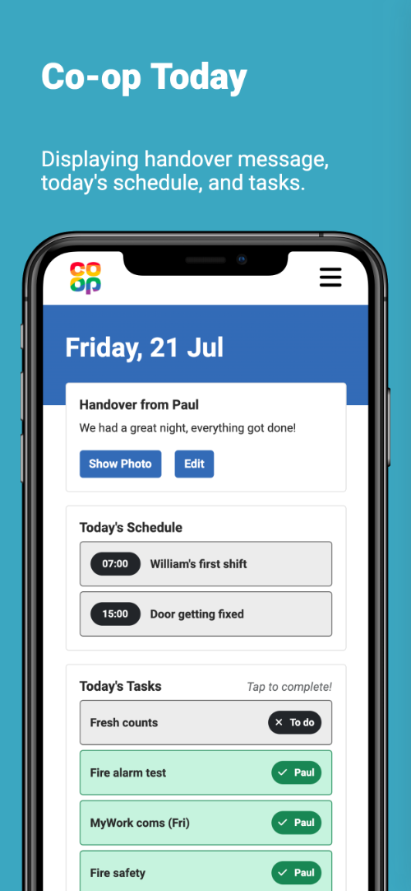
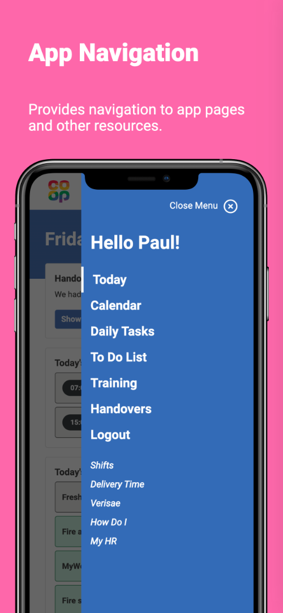
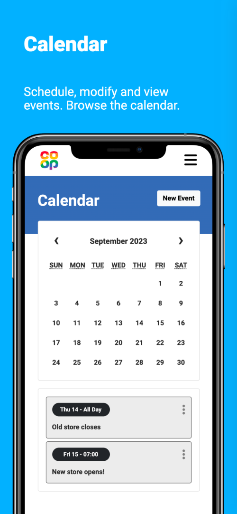
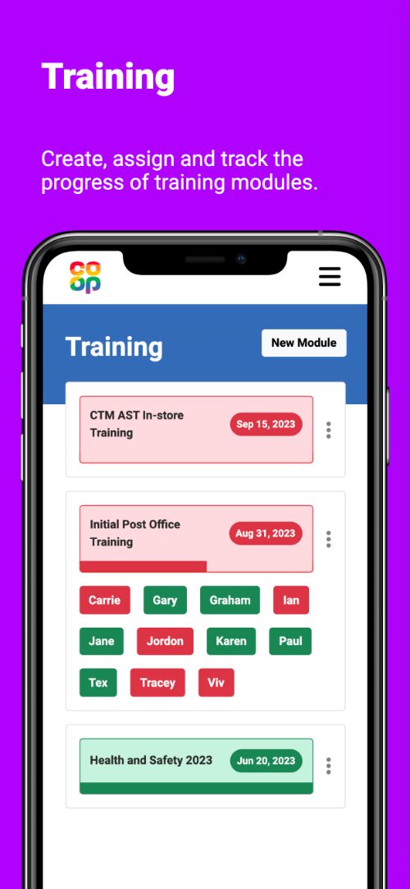
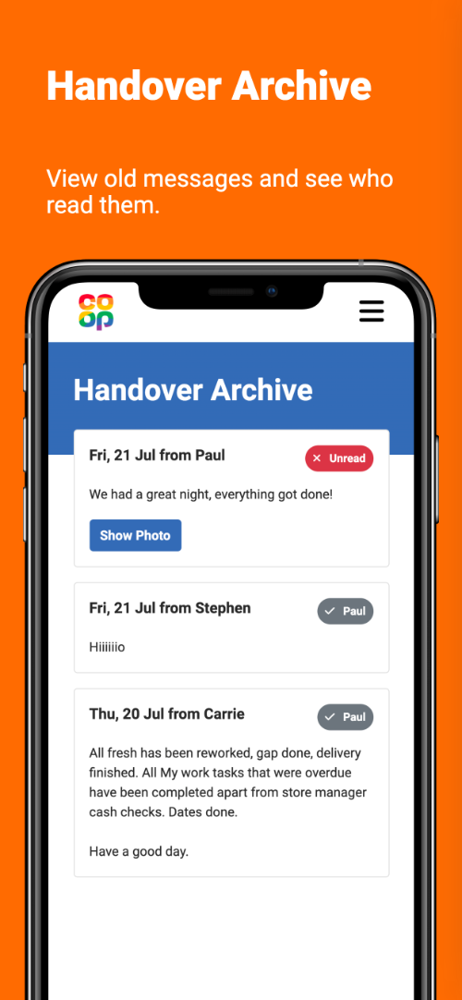
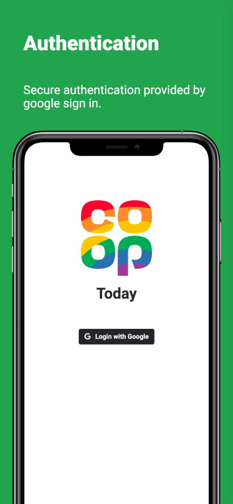
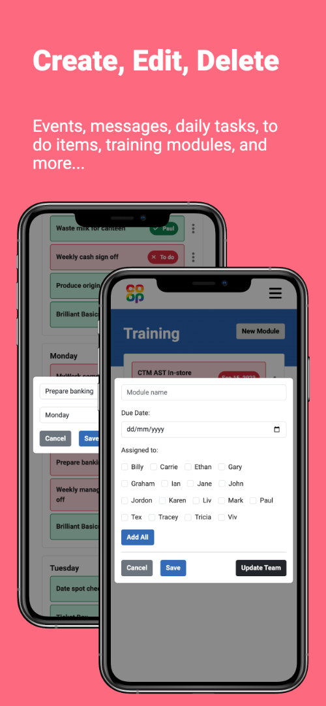

# Co-op Today V2

The second iteration of my to-do and scheduling application, now completely rebuilt with the power of React.

Using Google's Firebase to provide:

- Hosting
- Database
- Authentication
- Storage

Incorporating both React and Google's Firebase elevates the app's performance, user experience, and reliability.

